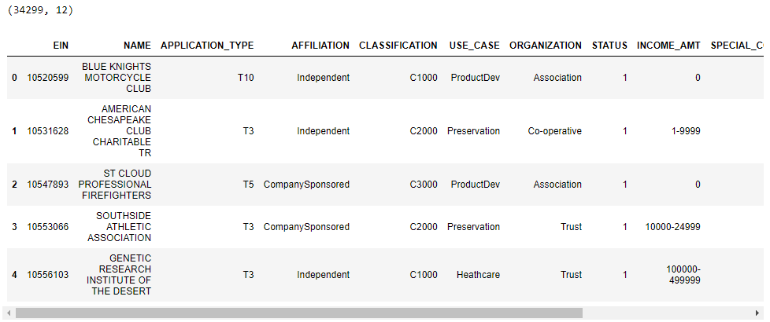
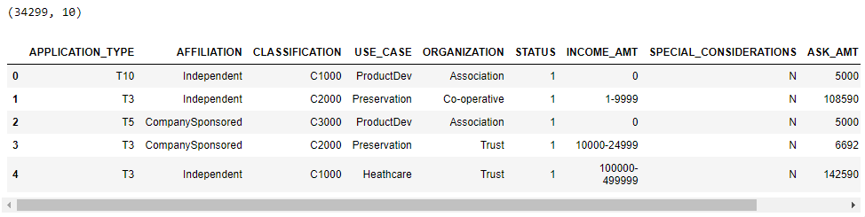
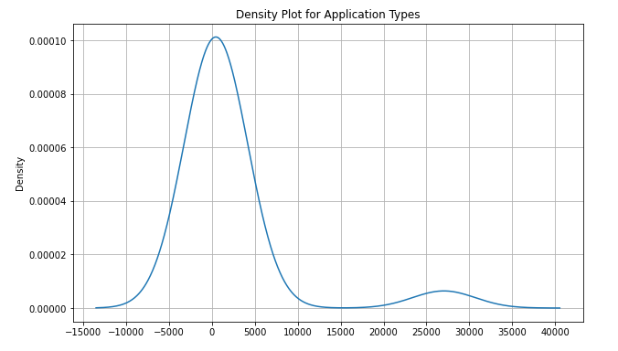
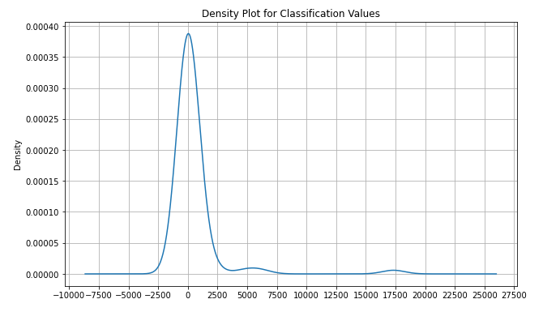
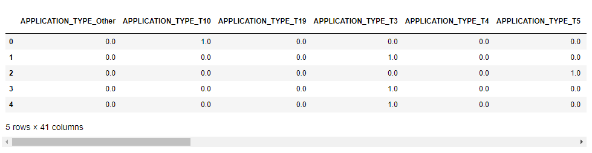
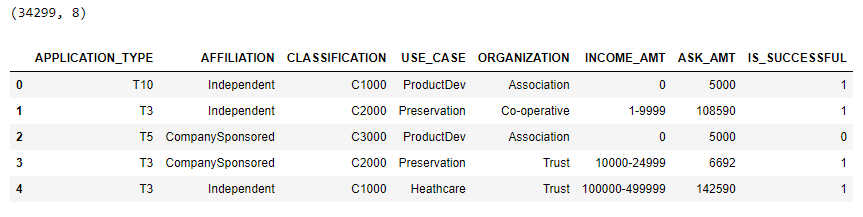
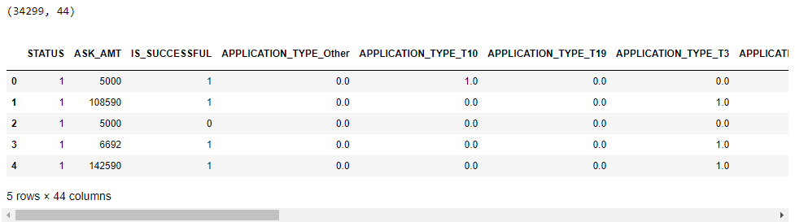
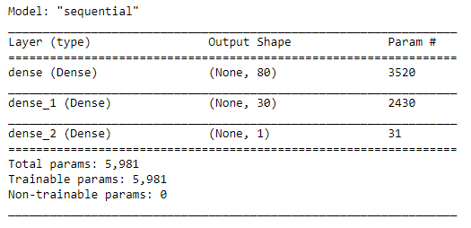
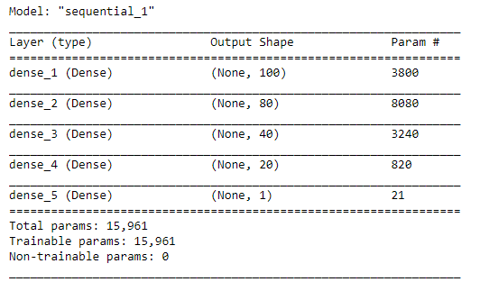

# Philanthropy_Classification_NNs
Using a deep-learning neural network to analyze and classify the success of charitable donations. 

## Background
*Alphabet Soup* is a non-profit philanthropic foundation dedicated to helping organizations that protect the environment, improve people's well-being, and unify the world.  

In the past 20 years, *Alphabet Soup* has raised and donated over 10 billion dollars. This money has been used to invest in life-saving technologies and organize reforestation groups worldwide.  

Unfortunately, not every donation the company makes is impactful. In some cases, an organization will take the money and disappear. As a result, *Alphabet Soup* president Andy Glad wishes to implement a new method to predict which organizations are worth donating to and which are too high risk.  
He is interested in a mathematical data-driven solution that can do this accurately.  

For that purpose, the company's senior data scientist, who is in charge of data collection and analysis for the entire organization, has requested an analysis of the impact of each donation and a new method to vet potential recipients. This analysis will help ensure that the foundation's money is used effectively.  

*Alphabet Soup*'s business team has provided a CSV data file that contains more than 34,000 organizations that have received funding from Alphabet Soup over the years.  
Within this dataset are several columns that capture metadata about each organization and can be used as features to train the predictive model.  

### Purpose
Analyzing previous donation records and vetting potential recipient organizations is too complex for regular statistical and machine learning models.  
Instead, we will design and train a deep learning neural network. This model will evaluate all types of input data and produce a clear decision-making result.  
Specifically, we will create a binary classifier capable of predicting whether applicants will be successful if funded by Alphabet Soup.

## Objectives
1. Preprocessing Data for a Neural Network Model.
2. Compile, Train, and Evaluate the Model
3. Optimize the Model.

## Resources 
- Data Sources: charity_data.csv, AlphabetSoupCharity.ipynb.
- Software & Framework: Python (3.7.13), Jupyter Notebook (6.4.11).
- Libraries & Packages: Pandas (1.3.5), matplotlib (3.5.1), Scikit-learn (1.0.2), tensorflow (2.3.0), keras-applications (1.0.8),  keras-preprocessing (1.1.2), 
- Online Tools: [Neural_Network_Charity_Analysis GitHub Repository](https://github.com/Magzzie/Neural_Network_Charity_Analysis)

## Methods & Code
1. Preprocessing Data for a Neural Network Model:  
Using Pandas library and Jupyter Notebook, we processed the dataset in order to compile, train, and evaluate the neural network model. 
    - We loaded the data file into a Pandas DataFrame and explored the included metadata.
    - The charity dataset contained (34,299) records organized in 12 columns about the previously funded organization by the Alphabet Soup foundation.
        ||
        |-|
    - We dropped the non-beneficial ID columns, 'EIN' and 'NAME.'
        ||
        |-|
    - Then, we identified the categorical variables with more than ten unique values using the nunique() method and bucketed them according to their corresponding density plots. 
        - The first categorical variable bucketed was **application types**, where the density plot showed that the most common unique values had more than 500 instances within the dataset. Based on that graph, we created an 'Other' bin to contain all application types with less than 500 instances.       
            ||
            |-|
        - The second categorical variable was **classification**. Using the density plot of the classification column unique values count, we decided to bin all classification values with less than 1,800 instances to an 'Other' class.         
            ||
            |-|        
    - Next, we used Scikit-learn's OneHotEncoder module to encode the categorical variables in the dataset and created a separate DataFrame of the encoded columns.          
        ||
        |-|
    - After encoding, we merged the encoded columns' DataFrame with the original application's DataFrame and dropped the unencoded categorical columns.    
    - Next, we needed to standardize our numerical variables using Scikit-Learn's StandardScaler class. However, we must split our data into the training and testing sets before standardization to not incorporate the testing values into the scale. Testing values are only for the evaluation of the model.
        - We defined our target column as 'IS_SUCCESSFUL' since it represents the outcome of funding a particular organization, which would be the prediction's goal. 
        - The input features influencing the neural network to predict the outcome were all encoded columns except for the predefined target column.
        - We used the train_test_split model from the Scikit-learn library to split our dataset into training and testing according to the default setting of 75%/25%, respectively. 
        - Lastly, we instantiated the StandardScaler model, trained it, and transformed the training and testing features separately.  

2. Compile, Train, and Evaluate the Model:
Using TensorFlow, we instantiated a Sequential deep learning model to classify the applications.
- The model consisted of:
    - One input layer of the 43 features.
    - Two hidden layers; the first had 80 neurons, while the second had only 30 neurons. Both layers used the **ReLu** activation function to enable training on nonlinear relationships between input features.
    - One output layer with one neuron and the **sigmoid** activation to produce a probability output. 
- Next, we imported ModelCheckpoint from the TensorFlow Keras callback library and created a checkpoints folder. 
- Then, we compiled the model and defined the loss and accuracy metrics.  
    - To enhance the performance of our classification neural network, we used the **adam** optimizer, which uses a gradient descent approach to ensure that the algorithm will not get stuck on weaker classifying variables and features.
    - As for the loss function, we used  **binary_crossentropy**, specifically designed to evaluate a binary classification model.
    - In addition to the optimization function and loss metric, we added a more reader-friendly evaluation metric, **accuracy**, which measures the quality of the machine learning model.
- We only saved the weights used to train the model in the first attempt. Moreover, for the 100 epochs used for training, we opted for saving checkpoints after every five epochs trained instead of after everyone so it would not take a lot of memory space. This choice required batch size (64) and batch counts specifications to define the saving frequency in the ModelCheckpoint instance. 
- After fitting the model to the scaled training features, we evaluated its performance on the scaled testing features and calculated the loss and accuracy. 
- Lastly, we exported the model to an [HDF5 file](https://github.com/Magzzie/Neural_Network_Charity_Analysis/blob/main/AlphabetSoupCharity.h5) for more convenient retrieval of the model's structure and weights at a later time. 

3. Optimize the model:
- The first optimization step was to drop noisy variables from the input features used in the previous deep learning model, so we studied the value counts of two columns of interest ('SPECIAL_CONSIDERATIONS', 'STATUS'). 
    - **SPECIAL_CONSIDERATIONS** column had 2 unique values (N, Y) with only 27 values as (Y) out of 34,299 records. 
    - **STATUS** column had 2 unique values (0, 1) with only 5 values as (0) out of 34,299 records. 
    - The resulting DataFrame had 34,299 applications in 8 columns only instead of 10 in the previous model.  
    
        ||
        |-|
- The second optimization step was to increase the number of values in the 'Other' bin of the 'APPLICATION_TYPE' column. Based on the value counts, we opted to increase the cutoff threshold of application types to 1,000 instead of 500 so that all classes would be in the order of thousands. 
- The third optimization step was to restructure the neural network model as follows: 
    - Increased the number of neurons in the first hidden layer from 80 to 100.
    - Increased the number of neurons in the second hidden layer from 30 to 80.
    - Added a third hidden layer with 60 neurons.
    - Added a fourth hidden layer with 40 neurons.
    - Changed the activation function of the hidden layer from **ReLu** to **Tanh**.
- Lastly, we decreased the batch size (the number of samples processed before the model is updated) from 64 to 32 to allow the model to find patterns more deeply and generalize better on the validation set. Furthermore, we increased the number of training epochs from 100 to 250.
- The optimized model [structure](https://github.com/Magzzie/Neural_Network_Charity_Analysis/blob/main/AlphabetSoupCharity_optimization.h5) and its [training weights](https://github.com/Magzzie/Neural_Network_Charity_Analysis/tree/main/checkpoints_optimized) were saved for reference. 

## Results 

- The charity_data.csv file initially contained (34,299) records of data in 12 columns. 
- The metadata of each organization included in the charity dataset were:
    - **EIN** and **NAME** —Identification columns
    - **APPLICATION_TYPE** —Alphabet Soup application type
    - **AFFILIATION** —Affiliated sector of industry
    - **CLASSIFICATION** —Government organization classification
    - **USE_CASE** —Use case for funding
    - **ORGANIZATION** —Organization type
    - **STATUS** —Active status
    - **INCOME_AMT** —Income classification
    - **SPECIAL_CONSIDERATIONS** —Special consideration for application
    - **ASK_AMT** —Funding amount requested
    - **IS_SUCCESSFUL** —Was the money used effectively
- We started the preprocessing phase of the analysis by dropping variables that would not add relative information to the prediction model. These were ID variables (EIN, NAME).
- After removing uninformative ID columns, bucketing values of categorical variables, and encoding all non-numerical columns in the dataset, we ended up with 44 columns for the neural network model. 
    ||
    |-|
    - We identified the input features that will influence the prediction of successful donations: application types, industry affiliation, government organization classification, the use case for funding, status, income classifications, asking amount, and any special considerations listed for an organization. 
- The prediction target is the funded organization's effective use of money. 
- The resulting training and testing sections of the charity dataset were as follows: 
    - X_train shape: (25724, 43)
    - X_test shape: (8575, 43)
    - y_train shape: (25724,)
    - y_test shape: (8575,)
- The features of both training and testing sections of the encoded dataset were scaled using Scikit-learn's StandardScler so that all numerical values have a mean of 0 and standard deviation of 1. 
- Using TensorFlow, we designed a neural network, or deep learning model, to create a binary classification model that can predict if an Alphabet Soup–funded organization will be successful based on the features in the dataset.
    ||
    |-|
- The deep learning model correctly identified organizations that previously received and successfully used donations from Alphabet Soup Foundation about 72% of the time.
- The loss rate of the data during the training and testing phases of the model's performance was considerably high at around 54-56%. 
- Considering that our input data included more than 40 different variables with more than 25,000 data points, the deep learning model could not produce a reliable classifier for more than 25% of the cases.
- Using TensorFlow, we optimized the deep learning model to achieve a target predictive accuracy higher than 75%. 
    - We reprocessed the input features where we removed two more noisy variables and increased the number of values in specific bins of categorical variables. Additionally, we restructured the neural network model by increasing the number of neurons and hidden layers, changing the activation function of the hidden layers to **Tanh** but leaving the output function as **sigmoid**. Furthermore, we decreased the batch size and increased the number of epochs. 
    
        ||
        |-|
    - We noticed a minimal change in the training accuracy from 0.7414 in the initial model to 0.7421 in the optimized model. 
    - The training loss was also very similar between the two models (initial: 0.5343 / optimized: 0.5334). 
    - The validating metrics were almost identical between the initial model and the optimized one with (Loss: 0.5592585206031799, Accuracy: 0.7233819365501404), and (Loss: 0.5691683888435364, Accuracy: 0.724781334400177), respectively.

## Conclusions
1. The deep learning neural network with ReLu and sigmoid activation functions correctly predicted the success and failure of organizations funded by the Alphabet Soup Foundation roughly 72% of the time. 
2. Optimization attempts to increase the prediction accuracy of the deep learning neural network model were unsuccessful despite exhaustive efforts to enhance the features of both model and data. 
3. A better understanding of the input data and an expansive feature engineering are recommended to build a more robust model that can analyze the patterns and criteria of funded organizations. 
4. We recommend using the RandomForest ensemble machine learning algorithm to study the charity dataset. The RandomForest model has advantages over other machine learning algorithms, such as its efficiency when analyzing large datasets, and it usually produces higher accuracy than other algorithms. 

---

